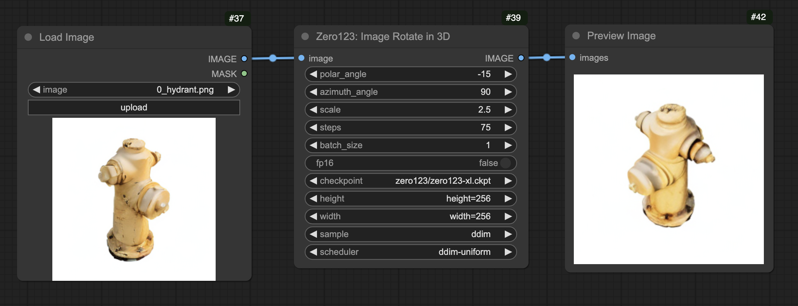

# ComfyUI 自定义节点 Zero-1-to-3: Zero-shot 单张图片全角度3D重绘

[英文](README.md)

这是一个非官方的 [Zero123:https://zero123.cs.columbia.edu/](https://zero123.cs.columbia.edu/) 移植 ComfyUI 自定义节点。实现使用单张 RGB 图像改变物体视角。

通过此移植，您可以在 ComfyUI 中生成 3D 旋转图像。


# 简单上手

安装此节点后，下载 样例工作流 [sample workflow](sample/simple_workflow.json) 开始使用。

## 前提条件

- 输入图像 `image` 必须是 `正方形` (宽=高)，否则将强制自动转换
- 输入图像 `image` 应该是一个具有 **`白色背景`** 的`物体`，请自行预处理图像。
- 输出图像 `image` 目前仅支持 `256x256` (固定)，可后期放大。

# 说明

## 参数输入与输出结果

### 输入

- *image*: 输入图像，应为`正方形`图像，且为具有`白色背景`的`物体`。
- *polar_angle*: `X` 轴的旋转角度，向上或向下转动
    - `<0.0`: 向上转动
    - `>0.0`: 向下转动
- *azimuth_angle*: `Y` 轴的旋转角度，向左或向右转动
    - `<0.0`: 向左转动
    - `>0.0`: 向右转动
- *scale*: `Z` 轴，`远`或`近`
    - `>1.0` : 更大、更近
    - `0<1<1.0`: 更小、更远
    - `1.0` : 不变
- *steps*: 使用原始 `zero123` 代码库中的默认值 `75`，建议不小于 `75`
- *batch_size*: 想要生成的图像数量
- *fp16*: 是否以 `fp16` 加载模型。启用可以加速并节省 GPU 显存
- *checkpoint*: 选择模型，`zero123-xl` 是当前最新的模型.
- *height*: 输出高度，固定为 256 不可变
- *width*: 输出宽度，固定为 256 不可变
- *sampler*: 固定不可变
- *scheduler*: 固定不可变

### 输出

- *images*: 输出图像

## 节点和工作流



## 提示

- 预处理图像时，识别主体，并移除所有背景。
- 使用图像裁剪，来聚焦主体，并转为正方形图像
- 尝试多张图像，选择最佳图像
- 针对最终图像，进行放大处理

# 安装

## 使用 ComfyUI Manager

### 自定义节点

搜索 `zero123` 选择本repo，进行安装。

### Models

搜索 `zero123`， 安装想要的模型。推荐 `zero123-xl.ckpt`.

## 手工安装

### 自定义节点

```
cd ComfyUI/custom_nodes
git clone https://github.com/kealiu/ComfyUI-Zero123-Porting.git
cd ComfyUI-Zero123-Porting
pip install -r requirements.txt
```

然后，重新启动 `ComfyUI`， 并刷新浏览器。

### 模型

打开 [`model-list.json`](model-list.json) ，获取模块下载 URL，并下载到 **`ComfyUI/models/checkpoints/zero123/`**

# Thanks to

[Zero-1-to-3: Zero-shot One Image to 3D Object](https://github.com/cvlab-columbia/zero123)

```
@misc{liu2023zero1to3,
      title={Zero-1-to-3: Zero-shot One Image to 3D Object}, 
      author={Ruoshi Liu and Rundi Wu and Basile Van Hoorick and Pavel Tokmakov and Sergey Zakharov and Carl Vondrick},
      year={2023},
      eprint={2303.11328},
      archivePrefix={arXiv},
      primaryClass={cs.CV}
}
```
